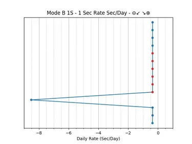

[](https://github.com/ysard/seiko_qt2100_converter/releases/latest/)
[](https://pypi.python.org/pypi/seiko_converter)
[](https://pypi.python.org/pypi/seiko_converter)
<!--[](https://github.com/ysard/seiko_qt2100_converter/actions)-->
[](https://interrogate.readthedocs.io/en/latest/)
<!--[](https://docs.pytest.org/en/latest/)-->
[](https://github.com/ysard/seiko_converter/blob/main/LICENSE)
[](https://liberapay.com/Ysard/donate)

# Seiko Qt-2100 converter

Seiko converter is a software allowing to generate graphs based on the raw data
produced by the Seiko Qt-2100 Timegrapher device.

## Background

By using an interface like the [Libre Printer](https://github.com/ysard/libre-printer) one,
which can replace a parallel or serial printer,
you can obtain data as sent by older devices whose printers have unfortunately broken down.

Sometimes old devices cannot be replaced for cost reasons or simply because there is no justification to do so.
However, they often work in pairs with printers that are no longer manufactured and are often the weak point of
the installation because they are prone to breakdowns and the abandonment of the manufacture of their consumables.

## Purpose
The printer linked to the Seiko Qt-2100 chronograph is one of those rare instruments whose
specifications have either never been published or have long been lost.

The specific aim of this project is to process the print data from this device, making it readable,
usable and printable again according to current modern standards.

### Note:
Neither the owners of this device, contacted on “enthusiasts” forums,
nor Seiko, wish to share the documentation for this device, which after more than 30 years
still seems to be an industrial secret, or intended only for a restricted circle of insiders.
As a result, many assumptions are being made about the precise operating
or simply about the units used in the graphs.
We welcome any contributions you can make to fill these gaps!

## Features


*In order from left to right, Print Mode A 10S graphs in 3 eras: the 70's,
actual concurrent project, this project*

### QT-2100 modes

This program automatically supports print modes A and B on the QT-2100.
Have a look at the page in the original manual that introduces them :
[image](./images/QT-2100P-Operating-Modes-in-Manual.jpg).

The mode C is covered by the CSV output (also available on all the other modes).

### Error corrections

As shown in the image above, dots resulting from measurement error on the
device's side are corrected using the most neutral value possible
(the average of the tick or tock values) and clearly displayed on the figure (red dot).

Here is another example in B1S mode:



```commandline
$ python -m seiko_converter -i test_data/seiko_qt2100_B1S_1.raw -g
```

### Horizontal or vertical layout

Horizontal layout is closer to the rendering of modern timegraphers,
but the readability of an ever-expanding downward graph can be easier.


```commandline
$ python -m seiko_converter -i test_data/seiko_qt2100_A10S.raw -g --horizontal
```

### Optional cutoff

Data can be added indefinitely to such a graph. Controlling value overflow for
long data series is important.
A cutoff value can be chosen automatically on the basis of the data or
specified by the user.

Here are the effects of automatic cutoff vs 10 seconds cuttoff:


```commandline
$ python -m seiko_converter -i test_data/seiko_qt2100_A10S.raw -g --vertical -c
$ python -m seiko_converter -i test_data/seiko_qt2100_A10S.raw -g --vertical -c 10
```

### CSV Export

For further analysis.

## Usage

```commandline
$ python -m seiko_converter -h
usage: __main__.py [-h] -i INPUT_FILE [-o [OUTPUT_FILENAME]] [--csv] [-g] [--horizontal] [--vertical] [-c [CUTOFF]] [-d] [--version] [-v]

options:
  -h, --help            show this help message and exit
  -i INPUT_FILE, --input_file INPUT_FILE
                        Raw file from device. (default: None)
  -o [OUTPUT_FILENAME], --output_filename [OUTPUT_FILENAME]
                        Generated file name. (default: None)
  --csv                 Extract the parsed values into a CSV file. (default: False)
  -g, --graph           Extract the parsed values into a timegrapher style file. (default: False)
  -d, --debug           Show the matplotlib windows. (default: False)
  --version             show program's version number and exit
  -v, --verbose

Graph options:
  --horizontal          Make a horizontal graph that expand downwards; default is vertical.
  --vertical            Make a vertical graph that expand downwards (default).
  -c [CUTOFF], --cutoff [CUTOFF]
                        Only for Mode A graphs. Allow wrapped display to limit infinite graph expansion on the right
                        direction (x-axis). If set on vertical graph: rate values will be cut; if set on horizontal graph:
                        days will be cut. Set it to True for auto-cut (2 days in horizontal mode), False for disabling the
                        feature, or with a custom value adapted to the chosen mode (limit value or time limit in days).
                        (default: True)
```

## Test data description

- seiko_qt2100_A10S.raw:

  109 measures in A10S mode; strict alternance between negative and positive values (ticks and tocks)

- seiko_qt2100_B1S_1.raw:

  14 measures in B1S mode; only negative values; 4 values + 6 errors + 1 outlier + 3 value

- seiko_qt2100_B1S_2.raw:

  19 measures in B1S mode; 4 values + 1 error + 5 values + 3 errors + 1 value + 1 error + 4 values


## License; Free and Open Source

Seiko converter is released under the AGPL (Affero General Public License).
